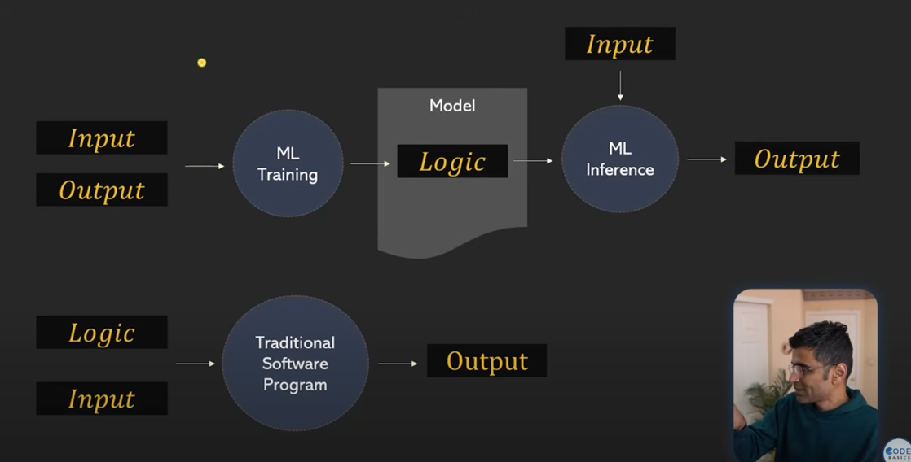
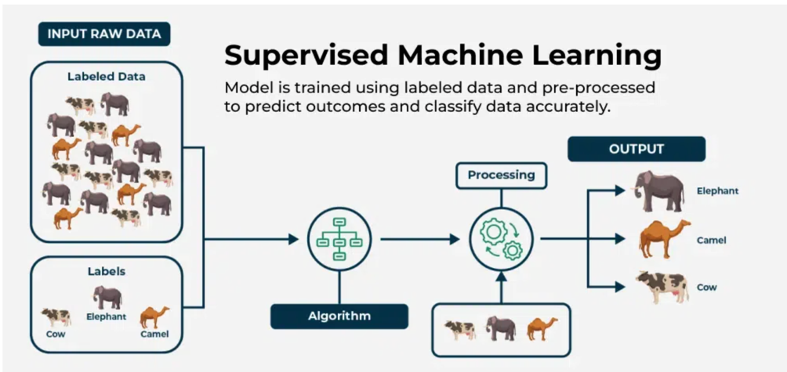
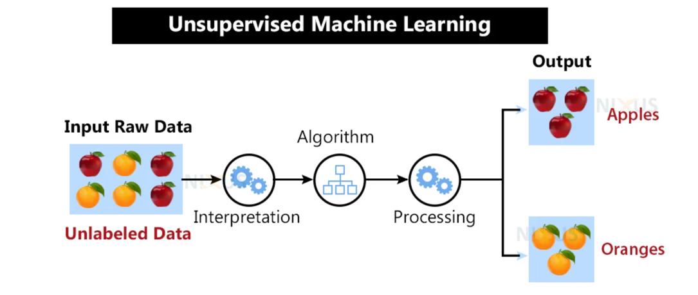
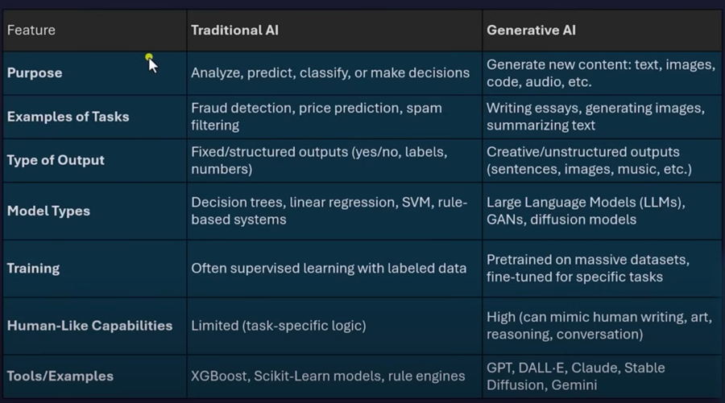

### Artificial Intelligence (AI)

- **AI** - is the simulation of human intelligence processes by machines, especially computer systems.

---

### Machine Learning (ML)
**ML** - Machine Learning is subdomain of AI that focuses on the development of algorithms that allow computers to learn
from and make predictions based on data. In traditional coding we write rules and logic to solve problems, in ML we provide
data and the model learns patterns from it. Simply, we can say that in traditional programming we have data and logic
to solve problems, in ML we have data and the model learns logic from the data.

**ML** - is a discipline in computer science where we train machines on data so that they can make predictions without explicit programming.

In ML 2 main branches: **Statistical ML** and **Deep Learning**.
- **Statistical ML** - Linear, Regression, Decision Trees, Random Forests, SVM, etc.
- **Deep Learning** - Neural Networks, CNNs, RNNs, Transformers, etc.

In **ML** there are 2 phases how the model works:
- **Training** - the model learns from a dataset.
- **Inference** - the model makes predictions based on new data.

An image that shows the difference between traditional programming and machine learning

#### Classification vs Regression

**Classification** - is a type of supervised learning where the output variable is a category, such as "spam" or "not spam".
There are two types of classification:
- **Binary Classification** - where the output variable can take two possible outcomes (e.g., spam or not spam).
- **Multiclass Classification** - where the output variable can take more than two possible outcomes (e.g., classifying
images of animals into categories like cat, dog, and bird).
- examples: email spam classification, image classification, fraud detection, etc.

**Regression** - is a type of supervised learning where the output variable is a continuous value, such as predicting
the price of a house based on its features.
- examples: predicting house prices, stock prices, temperature, salary prediction, etc.

#### Supervised vs Unsupervised Learning

**Supervised Learning** - is a type of machine learning where the model is trained on labeled data, meaning that
the input data is paired with the correct output. The model learns to map inputs to outputs based on this labeled data.
- examples: classification, regression, etc.
- Common algorithms: Linear Regression, Logistic Regression, Decision Trees, Random Forests, Support Vector Machines (SVM), etc.
- Applications: spam detection, image recognition, sentiment analysis, etc.
- Advantages: High accuracy, easy to interpret, can handle large datasets.
- Disadvantages: Requires labeled data, can be prone to overfitting, may not generalize well to unseen data.

**Unsupervised Learning** - is a type of machine learning where the model is trained on unlabeled data, meaning that
the input data does not have corresponding output labels. The model learns to find patterns and relationships in the data
without explicit guidance.
- examples: clustering, dimensionality reduction, anomaly detection, etc.
- Common algorithms: K-Means, Hierarchical Clustering, Principal Component Analysis (PCA), t-Distributed Stochastic Neighbor Embedding (t-SNE), etc.
- Applications: customer segmentation, market basket analysis, image compression, etc.
- Advantages: Does not require labeled data, can discover hidden patterns, can handle large datasets.
- Disadvantages: Harder to interpret results, may not always find meaningful patterns, can be sensitive to noise in the data.

#### Deep Learning (DL)

**Deep Learning** - is a type of machine learning where computers learn to solve complex problems by
using artificial neural networks with many layers. These networks can automatically find patterns in large amounts of data,
making deep learning very good at tasks like recognizing images, understanding speech, and translating languages.
 
Examples: Suppose you want a computer to recognize handwritten digits (0-9) from images. In deep learning, you use a neural
network with many layers. You show the network thousands of labeled images (each image with the correct digit). The
network automatically learns to find patterns in the images that help it tell the digits apart. After training, you 
can give it a new image, and it will predict which digit it is.

#### Criteria for choosing ML vs DL algorithms

| Criteria                        | ML (Statistical ML)         | DL (Deep Learning)           |
|----------------------------------|-----------------------------|------------------------------|
| Dataset size                     | Works well with small/medium| Needs large datasets         |
| Data type                        | Structured/tabular data     | Unstructured (images, text)  |
| Interpretability                 | High (easy to explain)      | Low (black-box models)       |
| Training speed                   | Fast                        | Slow (requires more compute) |
| Inference speed                  | Fast                        | Can be slower                |
| Computational resources          | Low (CPU is enough)         | High (needs GPU/TPU)         |
| Accuracy (with enough data)      | Good                        | Often higher                 |
| Overfitting risk                 | Lower                       | Higher (needs regularization)|
| Scalability                      | Good                        | Good with proper infra       |
| Labeled data requirement         | Less                        | More                         |

#### Neural Networks Architectures

**Neural Networks** - are a type of machine learning model inspired by the structure and function of the human brain.
They consist of layers of interconnected nodes (neurons) that process and learn from data. Each neuron receives input,
applies a mathematical function, and passes the output to the next layer. Neural networks can learn complex patterns and
relationships in data, making them powerful for tasks like image recognition, natural language processing, and more.

**Neural Networks** are composed of layers:
- **Input Layer**: The first layer that receives the input data.
- **Hidden Layers**: Intermediate layers that process the input data. Each hidden layer can have multiple neurons.
- **Output Layer**: The final layer that produces the output of the model.

#### Types of Neural Networks
- **Feedforward Neural Networks (FNN)**: The simplest type of neural network where information moves in one direction,
from input to output. No cycles or loops.
- **Convolutional Neural Networks (CNN)**: Specialized for processing grid-like data, such as images. They use convolutional layers
to automatically learn spatial hierarchies of features.
- **Recurrent Neural Networks (RNN)**: Designed for sequential data, such as time series or natural language. They have loops that allow
information to persist, making them suitable for tasks like language modeling and speech recognition.
- **Transformers**: A type of neural network architecture that uses self-attention mechanisms to process sequences of data.

---

### Generative AI

**Generative AI** - is a subfield of artificial intelligence that focuses on creating new content, such as images, text, music, or videos,
by learning patterns from existing data. It uses models that can generate new examples that resemble the training data.

#### Generative AI Models

- GPT, Claude, Gemini, Llama, etc. - are examples of generative AI models that can generate human-like text based on the input they receive.
- DALL-E, Midjourney, Stable Diffusion - are generative AI models that can create images from textual descriptions.
- MusicLM, Jukedeck - are generative AI models that can compose music based on given styles or themes.
- Sora - is a generative AI model that can create videos based on textual descriptions or prompts.

#### Traditional AI vs Generative AI

In traditional AI, models are designed to perform specific tasks based on predefined rules and logic. They rely on structured data
and often require extensive feature engineering. In contrast, generative AI models learn from unstructured data and can create new content
by understanding the underlying patterns in the data. They are capable of generating novel outputs that resemble the training data,
making them more flexible and creative in their applications.

#### Large Language Models (LLMs)

**Large Language Models (LLMs)** - are a type of generative AI that focuses on understanding and generating human language.
They are trained on vast amounts of text data and can perform various language-related tasks, such as translation, summarization,
and text generation. LLMs use deep learning techniques, particularly transformers, to process and generate text.

CHAT GPT

🔹 Step 1: Вступ до AI, ML, DL
Мета: Розібратись у відмінностях між AI, ML, DL
Що зробити:

Прочитати/переглянути:

"AI vs ML vs DL" (стаття або відео)

Andrew Ng: What is AI?

Зрозуміти типи навчання: supervised / unsupervised / reinforcement

Очікуваний результат:
→ Розумієш базові концепти і можеш пояснити їх своїми словами.

🔹 Step 2: Python + ML бібліотеки (базово)
Мета: Освоїти базові інструменти для ML
Що зробити:

Основи Python (якщо потрібно освіжити)

Ознайомитись з:

NumPy, Pandas — обробка даних

Scikit-learn — побудова ML-моделей

Пройти практичний туторіал (наприклад: "Iris classification with scikit-learn")

Очікуваний результат:
→ Знаєш як завантажити дані, підготувати їх і натренувати просту модель.

🔹 Step 3: Вступ до глибинного навчання (DL)
Мета: Зрозуміти що таке нейронні мережі
Що зробити:

Пройти курс або огляд:

DeepLearning.AI YouTube – Neural Networks Basics

Ознайомлення з бібліотекою TensorFlow або PyTorch (рекомендую PyTorch – простіше для початку)

Очікуваний результат:
→ Розумієш як працює feedforward NN, backpropagation, activation functions.

🔹 Step 4: NLP – обробка природної мови
Мета: Розуміти як обробляється і генерується текст
Що зробити:

Вивчити базові NLP задачі: токенізація, стемінг, аналіз сентименту

Попрактикуватись з HuggingFace Transformers

Зробити простий приклад генерації тексту (наприклад, GPT-2)

Подивитись що таке word embeddings (Word2Vec, GloVe, BERT)

Очікуваний результат:
→ Можеш самостійно запустити текстову модель і зрозуміти її логіку.

🔹 Step 5: Розуміння LLMs (GPT, Claude, Gemini)
Мета: Дізнатись як працюють сучасні великі мовні моделі
Що зробити:

Прочитати про transformers architecture

Ознайомитись із:

GPT (OpenAI)

Claude (Anthropic)

Gemini (Google)

Очікуваний результат:
→ Можеш пояснити, що таке LLM, чим GPT відрізняється від BERT і як це використовують у продакшні.

🔹 Step 6: Практика — прості кейси для продукту
Мета: Пов’язати знання з твоїм продуктом
Що зробити:

Згенерувати текст для оголошення (listing) за допомогою OpenAI API

Побудувати простий price predictor (набір характеристик → ціна)

Використати LangChain або OpenAI для створення базового чат-бота

Очікуваний результат:
→ Маєш 2-3 демонстраційні приклади, які можна презентувати.

📌 Таймлайн (гнучкий):
Step	Орієнтовно
Step 1: Вступ	1 день
Step 2: Python + ML basics	3–5 днів
Step 3: Deep learning	4–5 днів
Step 4: NLP	3–5 днів
Step 5: LLMs	2 дні
Step 6: Практика	4–6 днів

Хочеш — я можу зібрати цей план у PDF або додати в таблицю/шаблон IDP.

Ask ChatGPT
