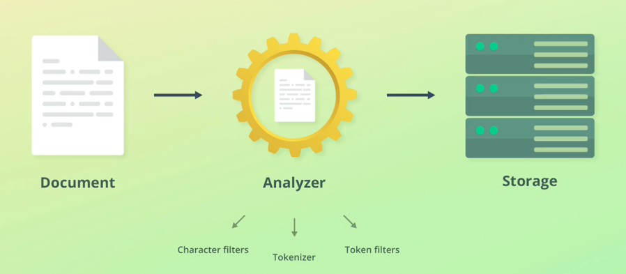
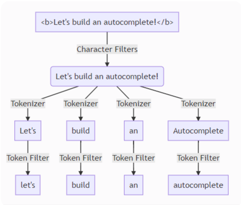

### Analyzer, CharFilter, Tokenizer, TokenFilter

Для ефективного пошуку текстових даних, текст який потрапляє в elastic проходить через процес `tokenization`. Це означає що дані, будуть опрацьовані та збережені спеціальним чином, щоб в подальшому elastic робив ефективний пошук.

Tokenization - це процес розбиття тексту на його менші частини (`token` або `terms` називаються) на основі певних правил.

---

### Analyzer:
- analyzer - це комбінація із `CharFilter`, `Tokenizers` та нуля або більше `Filter`. Він обробляє текст під час індексування та пошуку, перетворюючи його у формат, придатний для ефективного full-text пошуку.
- analyzer - складається із:
  - `CharFilter` - для первинної/базової валідації тексту
  - `Tokenizer` для розбиття тексту на `terms`
  - `Filter` щоб модифікувати, нормалізувати, або вдосконалювати `terms`.

---

### CharFilter:
- `char filter` - працює з необробленим текстом перед тим, як його токенізувати. Воно відповідає за виконання перетворень на рівні символів: HTML entity decoding, Unicode normalization, mapping певних символів в інші символи, і тд.
- зазвичай використовується для очищення або нормалізації тексту перед токенізацією, гарантуючи, що текст має узгоджений формат, придатний для подальшої обробки.
- приклади вбудованих CharFilters: `html_strip`, `pattern_replace`, `normalize_unicode`. Також, можна створювати свої кастомні.

---

### Tokenizer:
- `tokenizer` - відповідальний за розділення блоку із текстом в індивідуальні `terms` або `tokens`. Він розбиває текст на `terms` на основі певних критеріїв, таких як пробіли (whitespace), знаки пунктуації (punctuation) або правила мови (language-specific).
- Еластік надає великий список вдбудованих `tokenizers`, таких як: standard (default), whitespace, keyword, letter, lowercase, uax_url_email, і більше.
- Додатково, ми можемо створити кастомний `tokenizers`.

---

### Token Filter:
- `token filter` - виконує уніфікацію `terms`, наприклад: привести всі токени в lowercase.
- elastic надає великий список вбудованих `filters`, приклад: lowercase, uppercase, stop words, stemmer, synonym, word_delimiter, ngram, edge_ngram, shingle, phonetic, і тд.
- так само можуть бути створені кастомні `filter`.

Приклади фільтрів:
- `lowercase` - приводить всі токени до нижнього реєстру
- `uppercase` - приводить всі токени до верхнього реєстру
- `stemmer` - приводить слово до його базово формату
  - наприклад в нас є речення `I loved drinking bottles of wine on last year's vacation`
  - в цьому прикладі, слова: `loved`, `drinking`, `bottles`, `year's` не є базовою формою.
  - якщо ми спробуємо шукати по слові `loves`, то нічого не буде знайдено, тому що в нас збережене слово `loved`. 
  - використовуючи `stemmer` фільтр, ми можемо приводити всі слова до їх базових значеннь та зберігати в `inverted index`.
- `stop words` - перелік слів які не потрібно включати в `inverted index` так як вони не містять цінності в собі
  - наприклад, це можуть бути слова: "a", "the", "at", "of", "on", і тд.

---

### Вбудовані Аналізатори (Analyzers)

- `standard`
  - токенайзер в `standard` аналізаторі, розділяє текст по: пробілах, знаках пунктуації, та видаляє знаки пунктуацій
  - також `token filter` приводить токени до `lowercase` формату
  - `"Is that Peter's cute-looking dog?"` -> `["is", "that", "peter's", "cute", "looking", "dog"]`


- `simple`
  - дуже схожий до `standard` аналізатора
  - також `token filter` приводить токени до `lowercase` формату
  - `"Is that Peter's cute-looking dog?"` -> `["is", "that", "peter", "s", "cute", "looking", "dog"]`


- `whitespace`
  - розділяє слова на токени по пробілах
  - не використовується lowercase
  - `"Is that Peter's cute-looking dog?"` -> `["Is", "that", "Peter's", "cute-looking", "dog?"]`


- `keyword`
  - не працюючий аналізатор, який залишає вхідний текст не зміненим
  - використовується для полів із типом даних `keyword`
  - використовується для точного співпадіння
  - `"Is that Peter's cute-looking dog?"` -> `["Is that Peter's cute-looking dog?"]`


- `pattern`
  - regex використовується для розділення тексту на токени
  - шаблон за замовчуванням відповідає всім символам, які не є словами (\W+)
  - цей аналізатор може бути дуже гнучким
  - також `token filter` приводить токени до `lowercase` формату
  - `"Is that Peter's cute-looking dog?"` -> `["is", "that", "peter", "s", "cute", "looking", "dog"]`


- `language`
  - це аналізатор який оптимізований для багатьох мов: English, French, Spanish, Chinese, і тд
  - ці аналізатори попередньо налаштовані на основні основі лінгвістичних характеристик кожної мови.

---

### Summary

За замовчуванням спрацьовує `standard` аналізатор. Цей стандартний аналізатор, розділяє текст на токени по: пробілах, комах, крапках, тобто по символах пунктуації. Також, ці символи не будуть зберігатись в `inveted index`, тому що вони не містять ніякої цінності. Також, стандартний аналізатор приводить всі слова до lowercase формату.

- Якщо подивитись на приклади нижче, то ми побачимо `analyzer` і його компоненти:
- На початку дані (текст) приходять в `CharFilter`, де із текстом відбувається найперша фільтрація, наприклад очищення тексту від html-тегів
- Далі, текст приходить в `tokenizer`, де текст розбивається на токени по певному розділювачу. Наприклад розділювачем може бути пробіл. В результаті текст розділений по токенах
- Далі, ці розділені токени потрапляють в `TokenFilter`, де ці токени "нормалізуються". Наприклад вони можуть бути приведені до нижнього реєстру




- Тобто, в нас є наприклад текст "<b>Let's build an autocomplete!</b>", і в процесі токенизації, він буде розділений на ["let's", "build", "an", "autocomplete". І далі, ці токени, будуть збережені в `Inverted Index`, про що описано у відповідному файлі.

--- 

### Custom Analyzer

Ми можемо створювати свої кастомні аналізатори. Насправді, це є комбінація із `char filter`, `tokenizer` та `filter`, де ми підбираємо ці параметри в залежності від наших потреб. <br>

Роглянемо приклад: якщо спробуємо проаналізувати цей текст за допомогою `standard` аналізатора, то помітив дивний результат, а саме що html-теги не були видалені. Це тому що, в `standard` аналізаторі немає `char filter` для видалення html-тегів.
```
POST /_analyze
{
  "analyzer": "standard",
  "text": "I&apos;m in a <em>good</em> mood&nbsp;-&nbsp;and I <strong>love</strong> açaí!"
}

// отримаємо результат в якому не видалені html-теги
```

Ми можемо додати `"char_filter": ["html_strip"]`, який буде видаляти html-теги, та додати `"filter": ["lowercase"]` щоб приводити токени до нижнього реєстру.
```
POST /_analyze
{
  "char_filter": ["html_strip"],
  "tokenizer": "standard",
  "filter": [
    "lowercase"
  ],
  "text": "I&apos;m in a <em>good</em> mood&nbsp;-&nbsp;and I <strong>love</strong> açaí!"
}
```

І також, ми можемо створити кастомний аналізатор, який використаємо при створенні індекса.
```
// створюємо кастомний аналізатор із іменем my_custom_analyzer
PUT /index_name
{
  "settings": {
    "analysis": {
      "analyzer": {
        "my_custom_analyzer": {
          "type": "custom",
          "char_filter": ["html_strip"],
          "tokenizer": "standard",
          "filter": [
            "lowercase",
            "stop",
            "asciifolding"
          ]
        }
      }
    }
  }
}

// аналізуємо дані за допомогою кастомного аналізатора
POST /index_name/_analyze
{
  "analyzer": "my_custom_analyzer", 
  "text": "I&apos;m in a <em>good</em> mood&nbsp;-&nbsp;and I <strong>love</strong> açaí!"
}
```

---

### Synonyms

Під-час мапінгу ми можемо вказати фільтр `synonyms`. Цей фільтр означає що ми можемо створити слова та їх синоніми, наприклад нижче показаний синтаксис як в мапінгу вказати синоніми. Також на прикладі нижче вказано що синонім слова `awful` це `terrible`, для `awesome` це є `great, super` і тд. <br>
Якщо в нас є документ із такими даними `"name": "elastichserach is awesome"`, то ми можемо знайти цей документ шукаючи слово `great` або `super`  

```
PUT /synonyms
{
  "settings": {
    "analysis": {
      "filter": {
        "synonym_test": {
          "type": "synonym", 
          "synonyms": [
            "awful => terrible",
            "awesome => great, super",
            "elasticsearch, logstash, kibana => elk"
          ]
        }
      },
      "analyzer": {
        "my_analyzer": {
          "tokenizer": "standard",
          "filter": [
            "lowercase",
            "synonym_test"
          ]
        }
      }
    }
  },
  "mappings": {
    "properties": {
      "description": {
        "type": "text",
        "analyzer": "my_analyzer"
      }
    }
  }
}
```