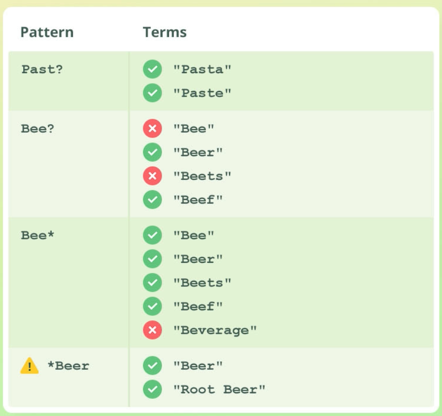

### Search

В elastic можна шукати за допомогою 2-ох методів:
- Request URI:
  - пошуковий запит пишемо в URL
  - використовується Apache Lucene's синтаксис
  - підтримує тільки відносно прості запити
  - використовується дуже рідко
- Query DSL:
  - пошуковий запит вказуємо як JSON об'єкт в request body
  - складніший в написані ніж Request URI, але підтримує більше функціоналу
  - використовується дуже часто

---

### Groups

В elastic існує декілька різних груп для пошуку даних

- Term Level Query
- Full Text Query
 
---

### Term Level Query

- використовується для пошуку структурованих даних по точному співпадінні
  - для прикладу: якщо ми хочемо в індексі `products` знайти `brand = Nike`, тобто виконуємо точне співпадіння
- Term Level - не аналізується 
  - це означає що, пошукове значення (search value) шукається в inverted index так як воно є
- може використовуватись із такими типами даних: keyword, numbers, dates, boolean, etc.
  - але не потрібно використовувати для `text` типу даних

Приклади:

Пошук по keyword типу даних
```
GET /products/_search
{
  "query": {
    "term": {
      "brand": {
        "value": "Nike"
      }
    }
  }
}
```

Пошук по boolean
```
GET /products/_search
{
  "query": {
    "term": {
      "is_active": {
        "value": false
      }
    }
  }
}
```

Пошук по integer
```
GET /products/_search
{
  "query": {
    "term": {
      "in_stock": {
        "value": 16
      }
    }
  }
}
```

Пошук по datetime, timestamp
```
GET /products/_search
{
  "query": {
    "term": {
      "created": "2007/10/14"
    }
  }
}

GET /products/_search
{
  "query": {
    "term": {
      "created": "2007/10/14 12:34:56"
    }
  }
}
```

Пошук із виключеною перевіркою на регістр
```
GET /products/_search
{
  "query": {
    "term": {
      "brand": {
        "value": "nike",
        "case_insensitive": true
      }
    }
  }
}
```

Пошук по декількох параметрах
```
GET /products/_search
{
  "query": {
    "terms": {
      "brand": ["Nike", "Adidas"]
    }
  }
}
```

Пошук по id 
```
GET /products/_search
{
  "query": {
    "ids": {
      "values": ["100", "200"]
    }
  }
}
```

Можливі опції для range пошуку: `gt`, `gte`, `lt`, `lte`. <br>
Ці опції та їх аналог в SQL: `gt : >`, `gte : >=`, `lt : <`, `lte : <=`. <br>
Пошук по range по полях із типом integer
```
GET /products/_search
{
  "query": {
    "range": {
      "in_stock": {
        "gte": 2,
        "lte": 17
      }
    }
  }
}
```

---

#### Пошук по range по полях із типом date

```
// базовий варіант
GET /products/_search
{
  "query": {
    "range": {
      "created": {
        "gte": "2020/01/01",
        "lte": "2020/01/31"
      }
    }
  }
}

// вказуючи час
GET /products/_search
{
  "query": {
    "range": {
      "created": {
        "gte": "2020/01/01 00:00:00",
        "lte": "2020/01/31 23:59:59"
      }
    }
  }
}

// вказуючи UTC offset
GET /products/_search
{
  "query": {
    "range": {
      "created": {
        "time_zone": "+01:00",
        "gte": "2020/01/01 01:00:00",
        "lte": "2020/02/01 00:59:59"
      }
    }
  }
}

// вказуючи date format
GET /products/_search
{
  "query": {
    "range": {
      "created": {
        "format": "dd/MM/yyyy",
        "gte": "01/01/2020",
        "lte": "31/01/2020"
      }
    }
  }
}
```

---

#### Пошук по prefix

Також, можливо шукати не по точному співпадінні, а по префіксу. <br>
Note: префікс повинен співпадати із початком токена, якщо подивимось на приклад нижче, то:
- `Nike Qwerty` - буде знайдено 
- `Qwerty Nike` - не буде знайдено 

```
GET /products/_search
{
  "query": {
    "prefix": {
      "brand": {
        // буде шукати всі значення які починаються із слова Nik
        "value": "Nik"
      }
    }
  }
}
```

---

#### Пошук по wildcard

Можна шукати по wildcard значеннях:
- `?` - означає, що 1 символ може бути будь-який
- `*` - означа що 0 символів або більше можуть бути будь-якими

Приклад, як воно працює: <br>
Note: не потрібно використовувати `*` (останній приклад на картинці) на початку патерна, тому що це зменшує швидкість роботи elastic <br>


```
GET /products/_search
{
  "query": {
    "wildcard": {
      "brand": {
        "value": "Nik*"
        OR
        "value": "Nik?"
      }
    }
  }
}
```

---

#### Пошук по regex 

Також можна, провидити пошук по regex, якщо нам потрібна якась складна логіка для пошуку 

```
GET /products/_search
{
  "query": {
    "regexp": {
      "brand": {
        "value": "Nik[a-zA-Z]+.*"
      }
    }
  }
}
```

---

#### Пошук по existing

Пошук, за допомогою якого можна знаходити які документи мають/або не мають значення

Знайти всі документи в яких є поле color і воно не пусте (не null або [])
```
GET /products/_search
{
  "query": {
    "exists": {
      "field": "color"
    }
  }
}
```

Знайти всі документи в яких поле color пусте
```
GET /products/_search
{
  "query": {
    "bool": {
      "must_not": {
          "exists": {
            "field": "color"
        }
      }
    }
  }
}
```

---

### Full Text Query

- використовується для пошуку не структурованих даних
- Full Text - аналізується
  - це означає що, пошукове значення (search value) спочатку проходить через analyzer і після цього шукається в inverted index
  - тобто, Full Text query аналізується точно так само як це значення було створено
- не використовувати цей пошук із полем `keyword`, для цього потрібно використовувати Term Level Query

Приклад
```
GET /products/_search
{
  "query": {
    "match": {
      "name": "Nike"
    }
  }
}
```

---

#### Operator OR - AND

Коли ми робимо пошук, і в ньому одне слово, то за замовчуванням спрацьовує оператор OR. Тобто, якщо подивитись на приклад нижче, то в рядку `Nike Max` будуть шукатись всі документи де присутнє значення `Nike` або `Max`. Якщо в документі присутні ці 2 значення, то такий документ отримує вищий score <br>
Приклад
```
GET /products/_search
{
  "query": {
    "match": {
      "name": "Nike Max"
    }
  }
}
```

Якщо ми хочемо знайти документ в якому міститься і слово `Nike` і слово `Max`, то потрібно використати `operator` опцію
```
GET /products/_search
{
  "query": {
    "match": {
      "name": {
        "query": "Nike MAX",
        "operator": "and"
      }
    }
  }
}
```

---

#### Пошук по декількох полях

Приклад пошуку значення `yellow` в полях `name, color`
```
GET /products/_search
{
  "query": {
    "multi_match": {
      "query": "yellow",
      "fields": ["name", "color"]
    }
  }
}
```

Якщо в нас є якесь поле яке важливіше ніж інші, то ми можемо вказати мультиплікаитор, щоб в полі `_score` це значення було вище. <br>
На прикладі нижче вказано що поле `name` буде множити свій `_score` на 4. Тобто, якщо при звичайному пошуку це значення було б 1.0000, то із цим мультиплікатором воно було б 4.0000 (ці цифри наведені тільки для демонстрації). Цей мультиплікатор може бути будь-яким. Це потрібно, якщо в нас є якесь поле, яке є важливішим за інші поля.
```
GET /products/_search
{
  "query": {
    "multi_match": {
      "query": "yellow",
      "fields": ["name^4", "color"]
    }
  }
}
```

---

#### Пошук по match_phrase

При пошуку за допомогою `multi_match`, `match`, нам все одно в якому порядку розміщуються слова. <br>
Наприклад, якщо в нас є документ `Adidas Max Yellow`, і ми будемо шукати рядок `Adidas Yellow`, то цей документ буде знайдено. <br>
Якщо нам потрібно зберегти послідовність пошуку, то ми можемо використати `match_phrase`, в такому випадку рядок `Adidas Yellow` - не буде знайдено. Але рядок `Adidas Max` чи `Max Yellow` - буде знайдено, саме тому що правильний порядок слів. 

```
GET /products/_search
{
  "query": {
    "match_phrase": {
      "name": "Adidas Yellow Max"
    }
  }
}
```

---

### Compound Query

Compound query - дозволяє будувати складні запити для пошуку даних. Під складними запитами, мається на увазі: коли в нас є декілька умов `where`.

- `must` - умова по якій шукається документ(и) повинен бути присутній. Також, вираховується `_score` для документів. Наприклад, якщо робити аналогію із MySQL `select * from products where brand = 'Nike'`, тобто знайти всі документи де `brand = 'Nike'`.
- `must_not` - документ по якій шукається документ(и) не повинен бути присутній. Зворотня логіка для `must`. 
- `should` - умова по якій шукається документ(и) є optional. Іншими словами, ця умова в документ, не обов'язково повинна бути присутньою, щоб документ був знайдений. Для чого тоді ця опція? Ця опція надає більший `_score` документам, які підпадають під неї, такі документи будуть вище знаходитись у видачі результатів.
- `filter` - дуже схожа до `must`, тільки тут не вираховується поле `_score`, за рахунок цього пошук за допомогою filter працює швидше, тому що еластіку не потрібно вираховувати `_score`.   

Опції:
- `minimum_should_match` - ця опція використовується із `should` запитом. Скільки співпадінь в документах повинно бути, щоб вони потрапили в результат

---

#### Приклади Compound Query

Приклад `must`, `must_not`

Аналогія із MySql: <br>
`select * from products where brand in ('Adidas, 'Puma') and color not in ('white', 'red')`

```
GET /products/_search
{
  "query": {
    "bool": {
      "must": [
        {
          "terms": {
            "brand": ["Adidas", "Puma"]
          }
        }
      ],
      "must_not": [
        {
          "terms": {
            "color": ["white", "red"]
          }
        }
      ]
    }
  }
}
```

---

Приклад `must`, `must_not`, `should`

Аналогії із MySql не можна провести, тому що в MySql немає такого як `should`. <br>
Приклад що робить запит нижче: знайти документи, де `brand` = 'Adidas', 'Puma', де `color` не 'white', 'red', і поставити документи вище де `color` = 'purple' та в `name` є слово 'qwerty'

```
GET /products/_search
{
  "query": {
    "bool": {
      "must": [
        {
          "terms": {
            "brand": ["Adidas", "Puma"]
          }
        }
      ],
      "must_not": [
        {
          "terms": {
            "color": ["white", "red"]
          }
        }
      ],
      "should": [
        {
          "term": {
            "color": {
              "value": "purple"
            }
          }
        },
        {
          "match": {
            "name": "qwerty"
          }
        }
      ]
    }
  }
}
```

---

Приклад тільки із `should`

Якщо ми шукаємо тільки за допомогою `should`, то в результаті ми отримаємо тільки ті документи, які підпадають під критерії. <br>
Приклад нижче: буде знайдено всі документи, де `color` = 'purple' або 'white', а документи які містять `color` і 'purple' і 'white' - буду відображатись вище у видачі

```
GET /products/_search
{
  "query": {
    "bool": {
      "should": [
        {
          "term": {
            "color": {
              "value": "purple"
            }
          }
        },
                {
          "term": {
            "color": {
              "value": "white"
            }
          }
        }
      ]
    }
  }
}
```

---

Приклад із `minimum_should_match`

На прикладі нижче `minimum_should_match = 2`, та ми маємо 3 умови в запиті `should`. Дана опція `minimum_should_match` означає, що в результаті (в списку документів), будуть тільки ті документи які мають як мінімум 2 співпадіння. Наприклад, документи в яких співпадає тільки `color` або `name` або `price` - не потраплять в результат, повинно бути саме 2 співпадіння та більше. 

```
GET /products/_search
{
  "query": {
    "bool": {
      "minimum_should_match": 2, 
      "must": [
        {
          "terms": {
            "brand": ["Adidas", "Puma"]
          }
        }
      ],
      "should": [
        {
          "terms": {
            "color": ["purple", "red", "white"]
          }
        },
        {
          "match": {
            "name": "qwerty"
          }
        },
        {
         "range": {
           "price": {
             "gte": 60
           }
         }
       }
      ]
    }
  }
}
```

---

#### Boosting Query

Boosting Query - означають що ми можемо зменшити `_score`, для документів

Приклад: хочемо знайти всі продукти в назві яких є слово 'juice', та при документи в яких є слово 'apple' в назві, зменшити їх `_score` наполовину (якщо було умовно 2.5, то буде 1.25) 

```
GET /products/_search
{
  "size": 20,
  "query": {
    "boosting": {
      "positive": {
        "match": {
          "name": "juice"
        }
      },
      "negative": {
        "match": {
          "name": "apple"
        }
      },
      "negative_boost": 0.5
    }
  }
}
```

---

### Контролювання Запитів

#### Контролювання які поля буду повертатись

В ключі `_source` ми можемо вказувати які саме ключі ми хочемо щоб повертались в документах. На прикладі нижче, вказано що будуть повертатись ключі "name", "price".

```
GET /products/_search
{
  "_source": ["name", "price"], 
  "query": {
    "match": {
      "name": "adidas"
    }
  }
}
```

#### Пагінація

В параметрі `size` можемо вказувати кількість документів яка повинна повертатись при пошуку

```
GET /products/_search
{
  "size": 2, 
  "query": {
    "match": {
      "name": "adidas"
    }
  }
}
```

В параметрі `from` можемо вказувати offset для документів. На прикладі нижче, вказано що беремо 2 документа із офсетом 0. Таким чином можна зробити пагінацію.

```
GET /products/_search
{
  "size": 2, 
  "from": 0,
  "query": {
    "match": {
      "name": "adidas"
    }
  }
}
```

#### Сортування

Для сортування є параметр `sort`, в якому можна вказати назву поля та опцію `desc` або `asc`

```
GET /products/_search
{
  "sort": [
    {
      "price": {
        "order": "desc" // or "asc"
      }
    }
  ], 
  "query": {
    "match_all": {}
  }
}
```

---

### Fuzziness

`fuzziness` - це функціонал який може корегувати пошуковий запит, наприклад якщо користувач буде шукати слово `yeelow` (тобто, допустив помилку), і в еластіку це слово збережене як `yellow`, то відповідно нічого не буде знайдено. Ми можемо використати опцію `fuzziness` щоб еластік шукав такі слова. <br>
Допустимі значення: `auto`, `0`, `1`, `2`. <br>
Значення означають скільки символів може бути замінено щоб знайти співпадіння, в прикладі із `yeelow` якщо ми вкажемо значення `1`, то буде знайдено співпадіння, тому що відбудеться тільки одна заміна символа  <br>
`auto` - ця опція працює наступним чином: 
- якщо слово (term) має довжину 1-2 символи, то має бути точне співпадіння
- якщо term має довжину 3-5 символів, то дозволяється замінити 1 символ
- якщо term має довжину більше 5 символів, то дозволяється замінити 2 символи 

Приклад запиту:

```
GET /products/_search
{
  "query": {
    "match": {
      "name": {
        "query": "yeelow",
        "fuzziness": "auto"
      }
    }
  }
}
```