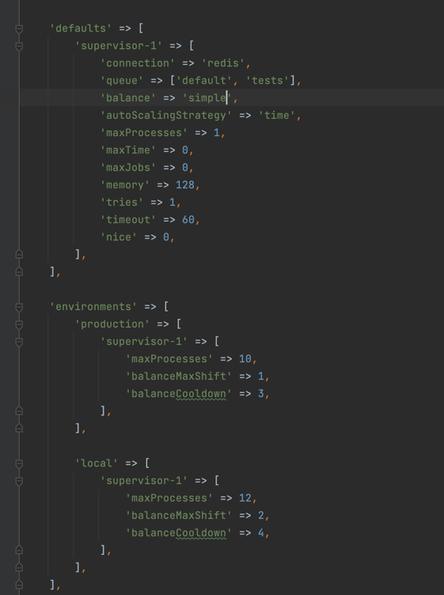

Horizon
- працює тільки із redis драйвером
- в `.env` файлі потрібно встановити `QUEUE_CONNECTION=redis`
- в `HorizonServiceProvider` в методі `gate()` можемо реалізувати логіку, хто буде мати доступ до horizon дашборду в продакшині. Наприклад, можна вказати що лише певні пошти будуть мати доступ до horizon дашборду
- замість `queue::work`, потрібно запускати `php artisan horizon`
- horizon створює файл конфігурацій `config/horizon.php` де можна налаштовувати роботу черг

---

Команди

- `php artisan horizon` - запустити horizon
- `php artisan pause` - зупинити horizon
- `php artisan continue` - відновити зупинений horizon
- `php artisan horizon:pause-supervisor supervisor-1` - зупинити конкретний супервізор
- `php artisan horizon:continue-supervisor supervisor-1` - запустити конкретний супервізор
- `php artisan horizon:status` - поточний статус horizon
- `php artisan horizon:terminate` - вбити поточний horizon
- `php artisan horizon:forget 5` - видалити зафейлину джобу, 5 - це id чи uuid
- `php artisan horizon:clear` - видалити всі джоби із default черги
- `php artisan horizon:clear --queue=emails` - видалити всі джоби із emails черги

---

`config/horizon.php`

- `domain` - використовується для саб-доменів
- `path` - із якого url буде доступний horizon дашборд
- `use` - <span style="color:red;">?</span>
- `prefix` - префікс для джоб які потрапляють в horizon черги
- `middleware` - мідлвари які застосовуються для url horizon дашборда
- `waits` - див пункт про сповіщення внизу
- `trim` - можна налаштувати скільки часу (в хвилинах) буде зберігатись інформація по джобах (по не давніх, зафейлиних, завершених і тд) 
- `silenced` - тут перелічуємо джоби які не хочемо зберігати в `completed`. Альтернативно, джоба може імплементувати інтерфейс `Silenced` 
- `metrics` - <span style="color:red;">?</span>
- `fast_termination` - <span style="color:red;">?</span>
- `memory_limit` - <span style="color:red;">?</span>

Важливий блок із конфігураціями знаходиться ось тут (нижче на фото)



- в `defaults` вказано налаштування за замовчуванням
- а в `environments` вказано налаштування для кожного середовища, вони перезатирають значення `defaults`. Наприклад, вказано `defaults.supervisor-1.maxProcesses => 1` і вказано `environments.production.supervisor-1.maxProcesses => 10`, це означає що для продакшина буде максимальна кількість процесів - 10, а по дефолту - 1.  
- note: якщо ми маємо іще середовище наприклад `stage`, нам потрібно описати налаштування для цього середовища теж `environments.stage....`
- на скріні вище вказано `supervisor-1` для кожного середовища. Ми можемо перейменовувати це, та додавати нові супервізори для управління процесами (воркерами), чергами. Наприклад, в нас в середовищі production може бути 2 супервізора. Навіщо це потрібно? якщо наприклад захочемо щоб один супервізор мав стратегцію балансування `auto` а інший `simple`, або щоб в кожного супервізора була різна кількість воркерів. 

Значення налаштувань

- `connection` - тут очевидно
- `queue` - вказуємо черги які horizon буде опрацьовувати
- `balance` - якщо в нас наприклад є 2 черги `default` та `tests`, то ми можемо застосувати різні стратегії як опрацьовувати ці черги
  - `auto` - є в нас наприклад 10 процесів, і в черзі `default` - 100 джоб, а в черзі `tests` - 0 джоб, то horizon використає 9 процесів для `default` черги і 1 процес для `tests` черги. Тобто, horizon буде пробувати ефективно розприділяти процеси між чергами
  - `simple` - є в нас наприклад 10 процесів, і в черзі `default` - 100 джоб, а в черзі `tests` - 0 джоб, то horizon розприділить по 5 процесів на кожну чергу, тобто не буде розприділяти в залежності від завантаженості черг
  - `false` - буде застосовуватись розприділення за замовчуванням, це означає що не буде розприділення процесів по чергах, а всі воркери будуть опрацьовувати першу чергу, потім другу чергу і тд
- `autoScalingStrategy` - це значення визначає, чи призначатиме horizon більше процесів до черг на основі загального часу, який знадобиться для очищення черги (стратегія `time`), чи загальної кількості завдань у черзі (стратегія `size`).
- `maxProcesses` - максимальна кількість процесів яка може бути запущена
- `minProcesses` - мінімальна кількість процесів яка може бути запущена
- `balanceMaxShift` - вказуємо скільки процесів будуть додаватись чи відніматись в залежності від завантаженості черг. Якщо вкажемо наприклад 3, то кожні n-секунд кількість процесів буде збільшуватись або зменшуватись на 3 в залежності чи завантажена чи пуста черга(черги)
- `balanceCooldown` - вказуємо кількість секунд із якою будуть додаватись чи відніматись процеси. Наприклад, якщо вкажемо 3, то кожні 3сек будуть додавати або видалятись процеси
- `maxTime` - <span style="color:red;">?</span>
- `maxJobs` - <span style="color:red;">?</span>
- `memory` - <span style="color:red;">?</span>
- `tries` - <span style="color:red;">?</span>
- `timeout` - <span style="color:red;">?</span>
- `nice` - <span style="color:red;">?</span>

--- 

Деплой

- при процесі деплою, потрібно вбити horizon `php artisan horizon:terminate`, і потім перезапустити заново. Навіщо потрібно вбити? тому що, horizon буде використовувати старий код (іще до деплою), а щоб він використовував новий код, треба спочатку його вбити і потім запустити заново.
- документація рекомендує створити на сервері супервізор, який буде запускати `php artisan horizon`, якщо випадково horizon вмре, або якщо ми зробимо деплой таким чином, щоб на початку деплою, спрацьовував terminate horizon, і потім він запуститься за допомогою супервізора.

---

Тегування

- horizon за замовчуванням пробує тегувати кожну джобу, якщо наприклад джоба щось робить із моделю `User`, то horizon спробує тегувати цю джобу `User:1`, де 1 це id юзера
- також, можна самостійно це робити, в джобі потрібно реалізувати метод `public function tags(): array`
- далі, по цих тегах можна шукати джоби

---

Сповіщення

- якщо ви хочете отримувати сповіщення, коли одна з ваших черг має тривалий час очікування, ви можете використовувати методи `Horizon::routeMailNotificationsTo`, `Horizon::routeSlackNotificationsTo`, та `Horizon::routeSmsNotificationsTo`. Ці методи потрібно викликати в `App\Providers\HorizonServiceProvider`
- також, в `config.horizon.php` в `waits` потрібно вказати налаштування скільки це 'тривалий час'. Тут вказана комбінація із `connection:queue`, і вказано скільки секунд рахується 'тривалий час'
```
'waits' => [
  'redis:critical' => 30,
  'redis:default' => 60,
  'redis:batch' => 120,
],
```

---

Метрики

- Horizon містить інформаційну панель показників, яка надає інформацію про джоби, час очікування в черзі та пропускну здатність
- для цього рекомендується запускати команду кожні 5хв, щоб зробити детальний графік `$schedule->command('horizon:snapshot')->everyFiveMinutes();` 