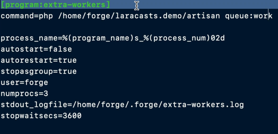

Основна ідея:
- `JOB` - клас який буде відправляти в чергу. Приклад в нас є клас `SendEmailJob`, і в цьому класі в методі `handler` виконується відправлення емейлу. Ми поміщаємо цю джобу в чергу, це можна зробити через глобальний хелпер `dispatch(SendEmailJob::class)`, або `SendEmailJob::dispatch()`. В залежності від наших налашнтувань, ми можемо мати чергу в `database`, `redis`, `sqs`, etc. Поклавши цю джобу в чергу, далі нам потрібно її дістати із черги та виконати. Для цього потрібно використати `php artisan queue:work`, ця команда дістає та виконує джобу. Все, наша джоба виконалась і черга буде пуста.
- `JOB` - клас який містить логіку яку потрібно обробити
- `dispatch()` - метод який відправляє джобу в чергу. Є також інші методи `dispatchIf`, `dispatchUnless` - по суті той самий діспатч, тільки є іще умова при якій відправити джобу в чергу
- `dispatchAfterResponse()` - метод який відправляє джобу в чергу, тільки після того як юзеру в браузер відправиться респонс. Не знаю для чого це може бути корисно
- `dispatchSync()` - не відправляє джобу в чергу, а виконує її одразу
- воркери які ми запускаємо, воно запам'ятовують код який був на момент їхнього запуска. Тобто, якщо ми запустили воркер, задеплоїли нові зміни (новий код), то воркер не буде знати про нові зміни. Для цього нам потрібно перед деплоєм, вбити воркери і після деплою заново їх запустити. Рекомендується налаштувати супервізор, який буде слідкувати за тим, щоб воркери завжди були запущен. Тобто, ми можемо перед (або після деплою) вбити воркери, а за допомогою супервізора, вони запустяться заново.

---

Команди, конфігурування:
- `php artisan queue:work` - команда яка запускає воркер
- `php artisan queue:listen` - якщо ми запускаємо `queue:work`, і потім ми деплоємо новий код, то нам потрібно перезапускати воркер, бо воркер не буде бачити нові зміни. Щоб не перезапускати воркер, можна використати команду `queue:listen`, яка буде за цим слідкувати, але вона працює набагато менш ефективно ніж `queue:work`. Тому, краще зробити супервізор який буде перезапускати `queue:work`, якщо вона раптом впаде
- `php artisan queue:work --max-jobs=1000` - `--max-jobs=1000` означає що опрацюються 1000 джоб із черги і воркер вмре
- `php artisan queue:work --stop-when-empty` - `--stop-when-empty` означає що воркер опрацює всі джоби із черги і вмре
- `php artisan queue:work --max-time=3600` - `--max-time=3600` означає що воркер попрацює 3600 сек і потім вмре
- `php artisan queue:work --sleep=3` - `--sleep=3` означає, що якщо в черзі немає джоб, то воркер 'засне' на 3 сек
- `php artisan queue:work --delay або delay()` - аргумент в консолі або метод в джобі, який використовується для затримки виконання джоби. Тобто, вона потрапить в чергу, але виконуватись одразу не буде. Приклад, `SendEmailJob::dispatch()->delay(5)` - означає що джоба виконається через 5 сек після потрапляння в чергу
- `php artisan queue:work --timeout або $timeout або timeout()` - аргумент в консолі або метод в джобі або публічна проперті в джобі. `public $timeout = 1`, що означає що якщо джоба не встигне виконатись за 1сек, то воркер зробить terminate цій джобі
- `php artisan queue:work --tries або $tries або tries()` - аргумент в консолі або метод або публічна проперті. `public $tries = 3`, що означає що якщо джоба була зафейлина 3 рази, то тільки після цього вона буде помічена як `failed`. Відповідно, якщо джоба була зафейлина 1 раз, то воркер спробує 2-ий раз виконати цю джобу, якщо знову фейл, то воркер спробує викнати 3-ій раз цю джобу. Якщо на 3-ій раз зафейлилась, то вона буде помічена як failed.
- нижче я не буду вказувати що параметр може бути вказаний як аргумент в консолі, метод чи публічна проперті, тому що це практично всі налаштування так можуть
- `public function retryUntil()` - метод, який ми можемо реалізувати в класі `SendEmailJob`, цей метод повинен повертати об'єкт `DateTime`, ми можемо вказати наступне `return now()->addMinutes(10);`. Це означає що, якщо джоба зафейлилась, то вона буде пробуватись виконатись іще, до поки не пройде 10хв (поки не стане expired). Тобто, за цей час джоба якщо зафейлилась, то вона може пробувати виконатись іще дуже велику кількість разів. Також, треба вказати `public $tries = -1;`, щоб кількість спроб була безлімітна, до поки не пройде 10 хв
- `public $backoff = 1` - це проперті означає, що якщо джоба зафейлилась, то вона спробує виконатись через 1сек. Тобто, якщо раніше джоба фейлилась, то вона одразу пробувала виконатись, без затримки в часі. А це налаштування означає, що джоба почекає 1 сек між фейлами
- `public $backoff = [1, 5, 10]` - також, можемо передати масивом, що означає затримка буде 1сек після 1-го фейлу, далі затримка буде 5сек після 2-го фейлу, і після 3-ього фейлу затримка буде 10сек 
- `->onQueue('queue_name')` - ми можемо створити чергу із окремим іменем. За замовчуванням всі джоби потрапляють в чергу `default`, в нас може виникнути ситуація коли ми наприклад маємо джобу `ProcessPaymentJob`, яка є більш приоритетною ніж `SendEmailJob`, але в нас вже черга заповнена джобами по відправці емейлу. В цьому випадку ми хочемо надати більший приоритет для джоб `ProcessPaymentJob`. Ми можем зробити наступне - `ProcessPaymentJob::dispatch()->onQueue('payments')` - тобто, в методі `onQueue('payments')` вказуємо чергу `payments`, розділяємо черги `payments` та `default`. Далі, ми можемо запустити іще один воркер `php artisan queue:work --queue=payments,default` - що означає, що спочатку опрацьовує джоби із чергу `payments`, і тільки потім джоби із черги `default`.
- `ShouldBeUnique` - це інтерфейс, який ми можемо реалізовувати в нашій джобі. Цей інтерфейс означає що, дана джоба може бути тільки одна в черзі, якщо спробувати додати декілька джоб в чергу - не получиться
- `uniqueId()` - метод (або проперті) який можемо реалізувати в джобі. По замовчуванні, назва класу це і є id джоби, якщо треба змінити id джоби, можемо використати цей метод. Це може бути корисним в комбінації із пунктом вище (про `ShouldBeUnique`). Тобто, ми маємо джоби `Run2E2Tests`, `RunIntegrationTests`, але хочемо щоб тільки одна із цих джоб була в черзі в момент часу (ці 2 джоби не повинні бути в черзі в один і той самий момент). В цьому випадку ми можемо реалізувати метод `uniqueId('tests')` для обох джоб і щоб обидві джоби реалізовували інтерфейс `ShouldBeUnique`.
- `uniqueFor()` - метод (або проперті) який ми можемо реалізувати в джобі. Воно означає скільки секунд джоба може бути унікальною в черзі. Якщо встановимо 60сек, то якщо за 60сек джоба не завершиться в черзі, то нова джоба із цим id буде додана
- `ShouldBeUniqueUntilProcessing` - це інтерфейс який означає наступне. Коли в нас є інтерфейс `ShouldBeUnique` - то це означає що джоба в черзі повинна бути унікальною до поки вона не опрацюється успішно або поки не зафейлиться. Якщо ми хочемо щоб наступна джоба додалась в чергу ДО моменту поки джоба із черги опрацюється або зафейлиться, тобто, як тільки джоба береться в роботу і ми хочемо закинути одразу наступну джобу в чергу, то ми повинні використовувати цей інтерфейс `ShouldBeUniqueUntilProcessing`
- `php artisan queue:prune-failed --hours=48` - видалити із таблиці зафейлених джоб всі записи старше 48год (якщо не передати `--hours`, то за замовчуванням буде 24год)
- `QUEUE_FAILED_DRIVER=null` - означає щоне будуть зберігатись зафейлині джоби
- `php artisan queue:clear` - видалити всі джоби із default queue
- `php artisan queue:clear redis --queue=emails` - видалити всі джоби із redis БД із черги emails

---

`config/queue.php`

- `retry_after` - треба пояснити як працює система джоб. Наприклад, є воркер який бере джобу в роботу. Ця джоба помічається як `reserved` щоб інші воркери не брали її в роботу. Ця джоба буде знаходитись в статусі `reserved` поки: не закінчиться успішно, не зафейлиться або може бути ситуація, коли джоба зависла і назавжди залишається в статусі `reserved`. Параметр `retry_after` був зроблений для цього випадку. Тобто, наприклад `retry_after` вказано як 90сек, то це означає що через 90сек ця `reserved` джоба буде знову готова для того щоб її інший воркер взяв в роботу. Це може бути трохи погано, розглянемо приклад: є довга джоба яка виконується 120сек і `retry_after = 90сек`, 1-ий воркер бере в роботу цю джобу, і після 90сек ця джоба знову релізиться в чергу (але 1-ий воркер іще опрацьовує її), і в цей момент 2-ий воркер бере цю джобу знову в роботу. Получається, що воркер іще обробляє джобу, але вона вже була релізнута в чергу заново. Рекомендується, встановлювати кількість секунд таку, щоб гіпотетично джоба яка має найбільший час виконання - встигла виконатись за цей час. Також, потрібно враховувати що в джоби іще є опція `timeout`, яка означає скільки часу джоба має на виконання. Потрібно, вказувати час `timeout` на декілька секунд менший ніж час `retry_after`, бо якщо буде навпаки, то може бути ситуація що джоба буде опрацьована двічі.   
- `block_for` - <span style="color:red;">?</span>

---

Handling attempts & Failures
- якщо джоба була зафейлина, вона потрапляє в таблицю `failed_jobs`. В `config/queue.php` є секція `failed` де ми можемо конфігурувати назву таблиці, в які БД будуть зберігатись зафейлині джоби 
- `php artisan queue:retry uuid (можна декілька uuid)` - ми можемо взяти із таблиці uuid зафейлиної джоби і відправити її знову в чергу.
- `php artisan queue:retry --queue=name` - закинути знову в чергу, всі зафейлині джоби із певної черги
- `php artisan queue:retry all` - закинути знову в чергу всі зафейлині джоби
- `php artisan queue:forget uuid` - видалити конкретну зафейлину джобу
- `php artisan queue:flush` - видалити всі зафейлині джобі
- `public $maxEceptions = 2` - також, можемо конфігурувати яка кількість максимальних exceptions може виникнути перед тим як помітити джобу failed. Наприклад в нас вказано `public $tries = 10; public $maxExceptions = 2`, то в цьому випадку якщо відбудеться 2 фейли через exception, джоба буде помічена як failed.
- `public function failed($e)` - в джобі ми можемо реалізувати метод `failed($e)`, який очікує exception який був викинутий. Ми можемо в цьому методі реалізувати якусь нам потрібну логіку (наприклад щось залогувати)

---

Workflows, Chain, Batches
- інколи нам потрібно виконати декілька джоб один за одним які між собою логічно пов'язані, в Ларавел існує 2 види для цього що звуться `chain`, `batches`
- `chain` - приклад, ми маємо 3 джоби які логічно пов'язані між собою і повинні виконуватись одна за одною. `Chain` означає що ці джоби будуть виконуватись одна за одною, і якщо одна джоба буде зафейлина, то буде зафейлений весь `chain` цих джоб
```
    $chain = [
        new PullRepoJob(),
        new RunTestsJob(),
        new DeployJob(),
    ];
    
    \Illuminate\Support\Facades\Bus::chain($chain)->dispatch();
```
- `batch` - метод схожий до `chain`, але в ньому відмінність, що якщо джоба буде зафейлина в `batch`, то наступні джоби будуть відпрацьовуватись. Також, потрібно додати трейт `Batchable` в джоби і запустити команду `php artisan queue:batches-table`, це створить міграцію і далі нам потрібно запустити цю міграцію. 
```
    $batch = [
        new PullRepoJob('project1'),
        new PullRepoJob('project2'),
        new PullRepoJob('project3'),
    ];
    
    \Illuminate\Support\Facades\Bus::batch($batch)->dispatch();
```
- <span style="color:red">`batch` - не зрозуміло наступне 'The batch method is used to group multiple jobs into a batch, and these jobs can be executed concurrently or sequentially'</span>
- <span style="color:red">`batch` - не зрозумілий приклад коли `$this->batch()->cancelled()`, і іще щось якщо якась джоба зафейлилась то весь batch помічений як cancelled. Цікаво, на що впливає цей cancelled статус? бо наступні джоби ж повинні виконуватись не дивлячись на те що якась джоба в batch була зафейлина</span>
- `catch` - в ланцюгу об'єкта `Bus` є також метод `catch`. Цей метод буде викликаний якщо відбудеться фейл якоїсь джоби в `chain` або `batch` методах
```
    $chain = [
        new PullRepoJob(),
        new RunTestsJob(),
        new DeployJob(),
    ];

    Bus::chain($chain)
        ->catch(function ($chain, $exception) {
            // write some logic
        })
        ->dispatch();
        
    $batch = [
        new PullRepoJob('project1'),
        new PullRepoJob('project2'),
        new PullRepoJob('project3'),
    ];
        
    Bus::batch($batch)
        ->catch(function ($batch, $exception) {
            // write some logic
        })
        ->dispatch();    
```
- `onQueue`, `onConnections` - також, ми можемо вказати що хочемо відправити `chain` або `batch` в якусь конкретну чергу і також можемо вказати що хочемо відправити їх в якийсь конкретний драйвер
```
    $chain = [
        new PullRepoJob(),
        new RunTestsJob(),
        new DeployJob(),
    ];

    Bus::chain($chain)
        ->catch(function ($chain, $exception) {
            // write some logic
        })
        ->onQueue('deployments')
        ->onConnection('database')
        ->dispatch();
```
- `then`, `finnaly`, `progress`, `catch` - існують методи які можуть виконуватись на різних етапах роботи джоб із `batch`
```
    $batch = Bus::batch([
        new ImportCsv(1, 100),
        new ImportCsv(101, 200),
        new ImportCsv(201, 300),
        new ImportCsv(301, 400),
        new ImportCsv(401, 500),
    ])->progress(function (Batch $batch) {
        // A single job has completed successfully...
    })->then(function (Batch $batch) {
        // All jobs completed successfully...
    })->catch(function (Batch $batch, Throwable $e) {
        // First batch job failure detected...
    })->finally(function (Batch $batch) {
        // The batch has finished executing...
    })->dispatch();
```
- `chained batches` - якщо дивитись приклад нижче, то бачимо що в методі `batch` передається багатомірний масив. В першому масиві передаються 2 джоби які відпрацюють як `chain` і в другомі масиві так само передаються 2 джоби які так само відпрацюють як `chain` - тобто, одна за одною. Метод `then` спрацює джоби в цих двух масивах відпрацюють. 
```
    Bus::batch([
        [
            new ReleasePodcast(1),
            new SendPodcastReleaseNotification(1),
        ],
        [
            new ReleasePodcast(2),
            new SendPodcastReleaseNotification(2),
        ],
    ])->then(function (Batch $batch) {
        // ...
    })->dispatch();
```
- може бути ситуація, що таблиця `job_batches` може наповнитись дуже швидко багатьма записами. Рекомендується видаляти записи із таблиці.
- `$schedule->command('queue:prune-batches')->daily();` - команда яка буде видаляти всі батчі із таблиці яким більше 24 год
- `$schedule->command('queue:prune-batches --hours=48')->daily();` - те саме, тільки буде видаляти ті яким більше 48 год
- `$schedule->command('queue:prune-batches --hours=48 --unfinished=72')->daily();` - те саме, тільки іще буде видаляти не закінчені батчі яким більше ніж 72 год
- `$schedule->command('queue:prune-batches --hours=48 --cancelled=72')->daily();` - те саме, тільки буде видаляти батчі які були відмінені 72 год тому

---

Controlling and Limiting Jobs

- <span style="color:red">`Cache::lock('deployments')->block(10, function () {})` - розібратись</span>
- <span style="color:red">`Redis::funnel()` - розібратись</span>
- <span style="color:red">`Redis::throttle()` - розібратись</span>

---

Міддлвар

- Мідлвари для джоб, те саме що і мідлвари в звичному розуміні. За замовчуванням, для них немає спеціального місця (директорії), тому можемо помістити їх де нам зручно. Ну і звісно, що як можемо створювати власні мідлвари так і можемо використовувати існуючі
- `ThrottlesExceptions` - це мідлвар який означає наступне. Наприклад в нас є АПІ яке не є стабільним, і воно починає повертати помилку. І в нас є джоба в черзі яка робить API реквест до цього ресурса. То ми можемо вказати, якщо ми отримуємо 10 exception на протязі 5хв в цій джобі, то ми зупиняємось на 5хв і потім ця джоба знову буде пробувати виконатись 
```
    public function middleware(): array
    {
        return [new ThrottlesExceptions(10, 5)];
    }
```
- якщо в нас є декілька джоб які працюють із стороннім API, і ми хочемо використати `ThrottlesExceptions` для всіх цих джоб які працюють із цим API. В такому випадку ми можемо дати ім'я цьому тротлінгу використовуючи `by()` метод. Тобто, тротлінг буде рахуватись не по одній джобі, а по всіх джобах де є такий ключ
```
  public function middleware(): array
  {
      return [(new ThrottlesExceptions(10, 10))->by('key')];
  }
```
- `WithoutOverlapping` - уявимо ситуацію коли в нас є джоба яка оновлює баланс юзера, і може бути ситуація коли є 2 джоби які оновлюють баланс юзера в той самий час. Щоб уникнути цього, ми можемо використати цей мідлвар. 

---

Інше

- може бути ситуація коли в нас виконується джоба в транзакції. На прикладі нижче в транзакції ми створює юзера і відправляємо йому welcome емейл, може трапитись ситуація що: ми створили юзера, відправили джобу в чергу, воркер бере із черги цю джобу і пробує її виконати, але транзакція іще не закінчилась і в нас немає цього юзера в БД, в цьому випадку отримаємо помилку. Щоб цього уникнути ми можемо використати метод `afterCommit()`, цей метод означає що джоба буде відправлена в чергу після коміту транзакції
```
    // може не працювати
    DB::transaction(function () {
        $user = User::create();
        SendWelcomeEmail::dispatch($user);
    });
    
    // джоба додасться в чергу після коміту транзакції
    DB::transaction(function () {
        $user = User::create();
        SendWelcomeEmail::dispatch($user)->afterCommit();
    });
```
- ми також можемо конфігурувати це глобально. В файлі `queue.php` в потрібно драйвері вказуємо `after_commit => true`
- в нашій джобі ми повинні звести до мінімума залежності. Так як, джоба перед відправленням в чергу повинна бути сериалізована і потім коли із черги ми дістаємо цю джобу її треба десереалізувати, то ми затрачаємо досить багато ресурсів на це.
- не потрібно передавати в нашу джобу якусь сенсетів інформацію чи креденшели в не зашифрованому вигляді, тому що коли джоба сериалізується, і зберігається в черзі, то значення цих секретних даних буде видно. Щоб зашифрувати пейлоад джоби, можемо використати інтерфейс `ShouldBeEncrypted` інтерфейс для цієї джоби

---

Supervisor

- це система управління процесами для Unix-подібних операційних систем. Він використовується для керування та контролю процесів, гарантуючи, що вони продовжують працювати та можуть бути налаштовані на автоматичний перезапуск у разі збою. Supervisor часто використовується для керування довготривалими процесами, демонами та фоновими завданнями.
- налаштування supervisor знаходиться в `/etc/supervisor/conf.d`. В цій директорії можемо створити файли конфігурацій, наприклад `extra-workers.conf`.

Приклад файлу налаштувань

- `[program:extra-workers]` - ім'я нашої програми. Ми його використовуємо коли потрібно запустити, зупинити воркер
- `command=php /home/forge/laracasts.demo/artisan queue:work` - назва команди яка запускається при запуску цього воркера (цього файлу конфігурацій)
- `autostart=false` - супервайзер не запускає автоматично програму коли робимо рестарт сервера
- `numprocs=3` - 3 процеса які запускають цю команду

Команди
- `supervisorctl reread` - команда для того щоб зчитати нові конфігурації 
- `supervisorctl update` - <span style="color:red;">???</span>
- `supervisorctl start extra-workers:*` - запустити воркери
- `supervisorctl stop extra-workers:*` - зупинити воркери

---

Поради від автора
- щоб не запускати вручну старт і стоп команди для супервізора, можна налаштувати крон який буде запускати та зупиняти супервізор в певний період дня (за умови якщо ми знаємо що в якийсь період дня буде навантаження і нам потрібні будуть воркери)
- якщо в нас немає розпорядку для запуска воркерів, ми можемо зробити наступне. Зробити крон команду, яка буде запускатись кожні 10хв, і ця команда буде перезапускати воркери якщо є якісь черги для обробки, якщо черг немає, то воркери не запустяться. Команда `php /home/forge/laracasts.demo/artisan queue:work --stop-when-empty`

---

Інформація із доки:

Jobs:
- в конструкторі джоби можемо мати модель, наприклад `User`, за допомогою трейту `SerializesModels` в джобі, він сериалізує та дисиреалізує коректно модель в чергу, разом із всіма зв'язками які є в цієї моделі. Note: в черзі буде сериалізований тільки id моделі, зроблено щоб не забивати payload джоби всією інформацією про модель. Під-час десириалізації, ларавел по цьому id спробує знайти модель в БД, і якщо її не буде (наприклад вже видалено), то буде exception `ModelNotFoundException` 
- якщо модель має зв'язки, але ми хочемо щоб джоба в черзі була без зв'язків, можемо це зробити за допомогою
```
public function __construct(private User $user)
    {
        $this->user = $user->withoutRelations();
    }
    
або

public function __construct(
    #[WithoutRelations]
    public Podcast $podcast
) {}
```
- метод `handle` автоматично робить ін'єкцію залежностей. У разі чого, ми можемо змінити авто ін'єкцію на нашу (якщо треба руками впровадити залежності в метод `handle`)
- інколи, нам може бути потрібно вручну відправити джобу в чергу, можна зробити це так
```
public function handle(): void
{
    $this->release();
}
```
- також можна вручну помітити джобу як failed
```
public function handle(): void
{
    $this->fail();
}
```
- можна не створювати джобу, а використовувати callback
```
dispatch(function () use ($podcast) {
    $podcast->publish();
})->catch(function (Throwable $e) {
    // This job has failed...
});
```
- зафейлині джоби можна також зберігати в DynamoDB від AWS
- можна зробити лістенер який буде слухати івент зафейлиної джоби, це можна зробити в `AppServiceProvider`
```
public function boot(): void
    {
        Queue::failing(function (JobFailed $event) {
            // $event->connectionName
            // $event->job
            // $event->exception
        });
    }
```
- також є іще лістенери `before`, `after` які запускаються перед та після виконання джоби, їх так само можна зареєструвати в `AppServiceProvider`
```
public function boot(): void
    {
        Queue::before(function (JobProcessing $event) {
            // $event->connectionName
            // $event->job
            // $event->job->payload()
        });
 
        Queue::after(function (JobProcessed $event) {
            // $event->connectionName
            // $event->job
            // $event->job->payload()
        });
    }
```

---

Не зрозумілі розділи із документації

- Redis
  - Redis Cluster 
  - Blocking
  - Unique Job Locks