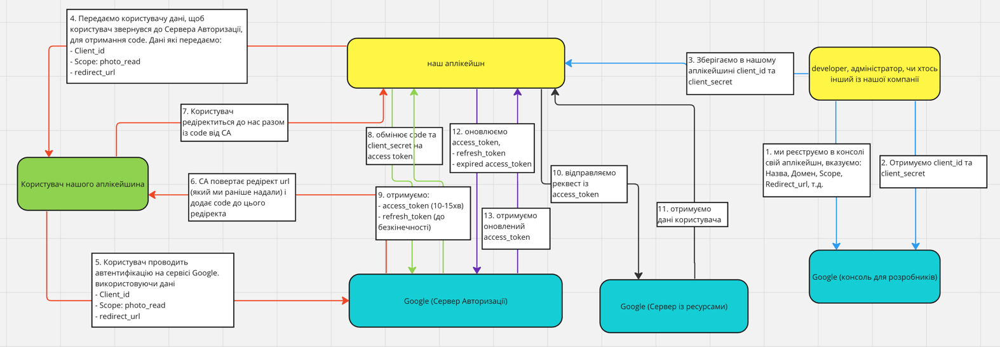
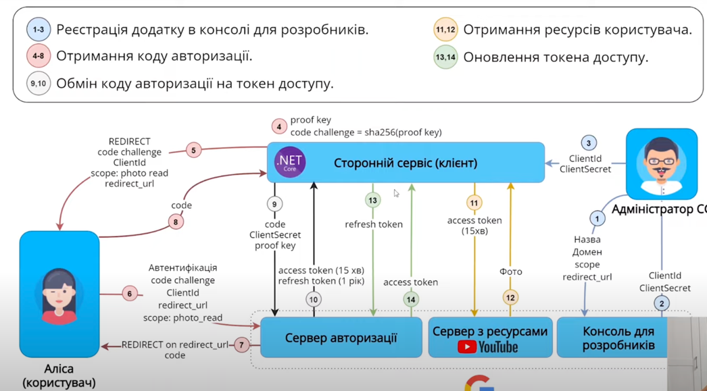

OAuth 2.0

- OAuth 2.0 являє собою протокол для авторизації, що дозволяє програмам здійснювати обмежений доступ до облікових записів користувачів на інших серверах, наприклад: Facebook, GitHub, DigitalOcean, etc. Він працює за принципом делегування аутентифікації користувача сервісу, на якому знаходиться обліковий запис користувача, дозволяючи сторонньому додатку отримувати доступ до облікового запису користувача. В залежності від того який тип додатку: Web, Web SPA, декстопний, mobile, і тд., може частково відрізнятись реалізацію, та загальна ідея залишається без змін.

---

Як це працює

Нижче 2 зображення як працює протокол OAuth2. Процес на цих флоу є однаковий, 2 зображення тут для того, якщо на одному буде щось не зрозуміло, то можна подивитись на друге

Консоль Розробника

1. для початку, нам потрібно зареєструвати наш аплікейшн в консолі розробника сторонього сервіса. Наприклад, ми хочемо зробити це із Google. Для цього треба перейти в консоль для розробника Google, вказати там інформацію про наш додаток: name, domain, scope, redirect_url, etc.
2. Google поверне нам `client_id` та `client_secret`, які в подальшому треба буде використовувати для наступних запитів
3. отриманні `client_id` та `client_secret` треба зберегти в нас в аплікейшині

Авторизація Клієнта

4. генеруємо посилання для користувача, по якому користувач має перейти та потрапити на Сервер Авторизації (тобто, це має бути посилання на Google, наприклад `https://google.com/autorization....`). І до цього посилання нам потрібно додати в якості query-параметрів: `client_id`, `scope`, `redirect_url` (тобто, має вийти щось таке `https://google.com/authorization?client_id=12345?scope=read_photo?redirect_url=https://our-web-application/callback`)
5. далі, користувач натиснувши на це посилання, переходить на Сервер Авторизації (в нашому випадку Google). На цьому етапі користувача запитають, чи надає він дозвіл нашому веб-сайту, до його ресурсів на Google. Користувач може погодитись або ні. Якщо користувач не погоджується, на цьому процес завершуються. Якщо користувач погоджується, переходимо до наступного кроку   
6. після того як користувач погодився, Сервер Авторизації редіректить користувача по `redirect_url` який ми вказали в 4-му пункті, і до цього `redirect_url` додає в якості query-параметра `code`
7. користувач редіректиться на наш веб-сайт разом із `code`

Отримання `access_token`, `refresh_token`

8. далі, відправляємо до Сервісу Авторизації Google отриманий `code` та `client_secret`, щоб отримати `access_token` та `refresh_token` (щоб отримати `refresh_token`, у випадку із Google то потрібно відправити додатковий параметр `grant_type => authorization_code`, тому можливо в інших сервісах що теж потрібно відправити такий параметр)
9. отримуємо `access_token` (короткостроковий токен на 10-15хв) та `refresh_token` (довгостроковий токен на 6-12міс або безкінечний)

Отримання даних користувача

10. можемо відправляти запити використовуючи `access_token`, щоб отримувати ресурси користувача (якщо це дозволяє `scope`, який ми використали раніше)
11. отримуємо ресурс (дані) користувача

Refresh Token

12. так як `access_token`, має короткий період життя, то нам потрібно його оновлювати. Для цього, нам потрібно відправити запит із `refresh_token` та протермінований `access_token`
13. і отримаємо новий `access_token`, який можемо використовувати

---

Ролі

- `Власник Ресурсів (користувач)` - це є користувач, який користується нашим сайтом та хоче на нашому сайті авторизуватись через сторонній сервіс. Доступ нашого сайту до акаунта користувача обмежений `scope`
- `Клієнт` - наш веб-сайт, який хоче отримати дані користувача із іншого ресурса (перед отриманням даних, потрібно на стороньому сервісі, у консолі для розробників зареєструвати наш веб-сайт)
- `Сервер Aвторизації` - сервер, який автентифікує власника ресурсу та видає токени доступу після отримання авторизації.
- `Сервер Ресурсів` - сервер, на якому розміщені захищені ресурси, до яких клієнт хоче отримати доступ.

---

Токени

- `access_token` - це токен, який клієнт відправляє в реквесті для доступу до захищених ресурсів на Сервері Ресурсів. Вони представляють авторизацію, яка була надана клієнту.
- токени може бути короткочасними (наприклад, `access_token`) або довгостроковими (наприклад, `refresh_token`).

Scope

- визначає які в клієнта є дозволи до ресурсів. Тобто, чи має Клієнт доступ до читання даних користувача в ресурсі? чи має Клієгт доступ до редагування даних користувача в ресурсі? і т.д.

Authorization Endpoint

- ендпоінт, де Власник Ресурсі взаємодіє з Сервером Авторизації, щоб надати або заборонити доступ до своїх ресурсів.

Token Endpoint

- ендпоінт, де Клієнт обмінює `code` або `refresh_token` на `access_token`

Redirect URI

- ендпоінт, до якого Сервер Авторизації перенаправляє Власника Ресурсів (користувача) після того, як Власник Ресурсу надає або відхиляє доступ до своїх ресурсів.

Refresh Tokens

- використовуються для отримання нових `access_token` доступу без участі Власника Ресурсу. Вони забезпечують спосіб підтримувати постійний доступ